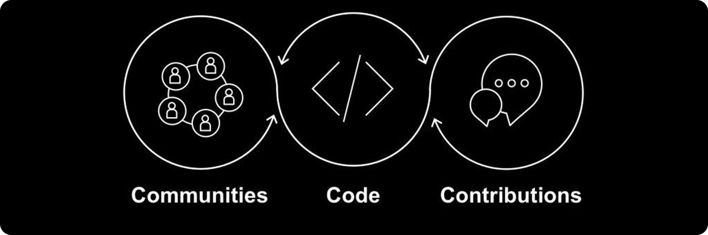
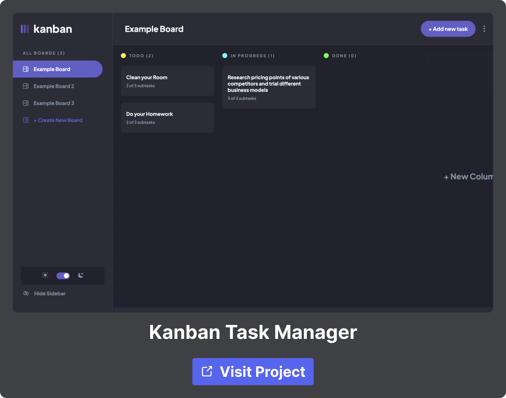

<h1 align="center">Hello, 👋 I’m Rajeev Kumar</h1>

## 🙋🏻 Featured Profiles

### 👨‍💻 Design & Code:

### 📝 Read My Blogs:

 
  
<h2>🚀 Featured Projects</h2>

 

 
  
<h2>🛠️ Tools & Technologies</h2>
<!-- # My Favorite Tools -->

### 👨‍💻 Programming & Markup Languages:

 

  

### 🎒 Frameworks, Platforms and Libraries:

### 🍥 Design Platforms:

 
  
<h2>📈 GitHub Stats</h2>

 

